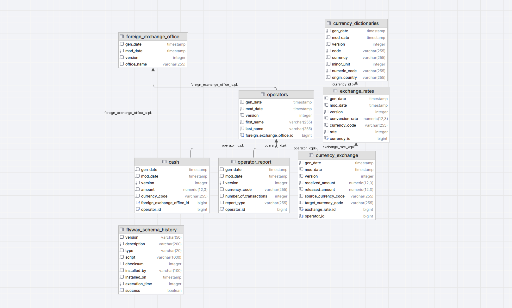

# Steps to run the project
### 1. From root folder run in command line following commands:
- gradle flywayMigrate
- gradle run

The application will start on default port: 8080

 PostgreSQL version 12
 Spring Boot version 2.6.2
 JDK 11

### 2. Exposed Endpoints

##### API Operation insert new exchange rates
POST http://localhost:8080/api/v1/exchange-rates
 JSON Body example:
 {
 "currencyCode": "USD",
 "rate": 1,
 "conversionRate": 21.70
 }

 Returns 201 HttpStatus
 Returns 404 HttpsStatus with exception message

---------------------------------------------------------------------------------
##### API Operation fetch exchange rate for a currency for a given date
GET http://localhost:8080/api/v1/exchange-rates/currencies/{currencyCode}/dates/{date}

Returns 200 HttpStatus 

---------------------------------------------------------------------------------
##### API Operation to simulate an exchange, only MDL is accepted as source, target should exist currency dictionary. Also, a valid operator should exist.
POST http://localhost:8080/api/v1/exchange-currencies
JSON Body example:
 {
 "targetCurrencyCode": "MDL",
 "sourceCurrencyCode": "USD",
 "conversionRate": 20.00,
 "rate": 1,
 "receivedAmount": 100.00,
 "releasedAmount": 2000.00,
 "operatorId": 1
 }

 Returns 201 HttpStatus
 Returns 404 HttpsStatus with exception message

---------------------------------------------------------------------------------
### API Operation to simulate some cash corrections
PUT http://localhost:8080/api/v1/cash
 JSON Body example:
 {
 "operatorId": 1,
 "currencyCode": "EUR",
 "amount": 100.50,
 "date": "2023-11-26"
 }

 Returns 200 HttpStatus
 Returns 404 HttpsStatus with exception message

### 3. Database schema

#### Disclaimer
#### Project just represent some reactive operations and validations. Logic regarding exchange rate, validations is missing!
